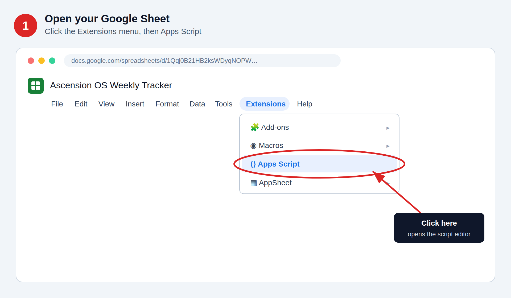
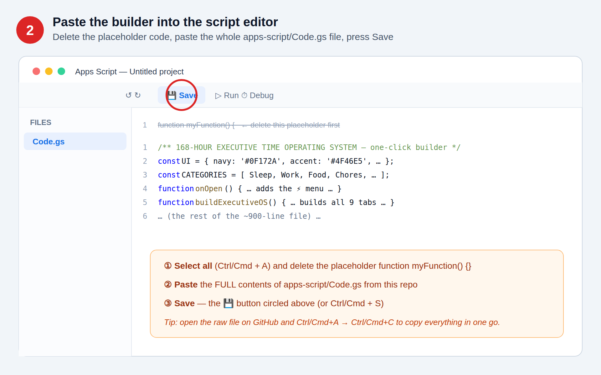
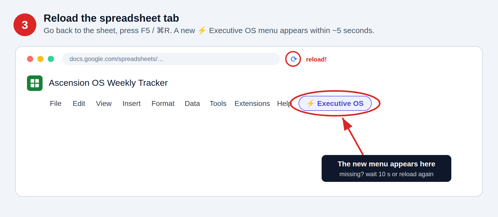
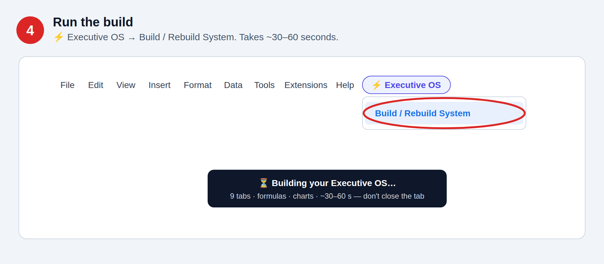
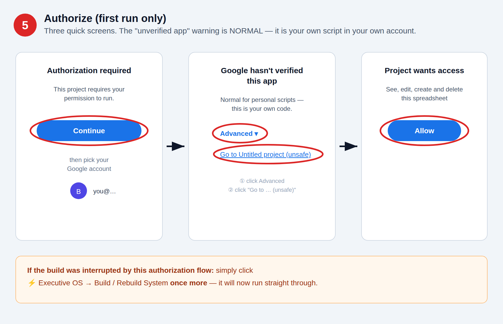
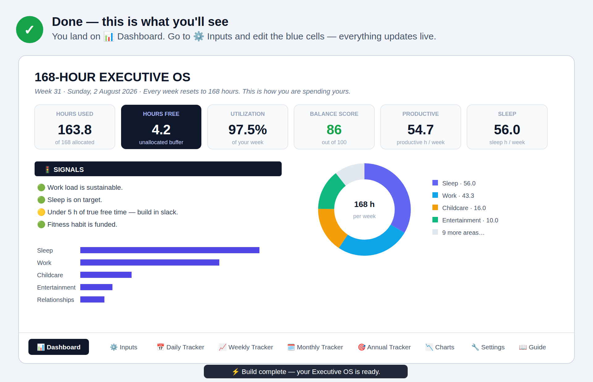

# 🚀 Deployment & Integration Guide
### 168-Hour Executive Time Operating System for Google Sheets

This guide covers every way to deploy the Executive OS, from the 2-minute manual
install to CLI-based deployment and distributing it as a commercial template.

---

## 1. What you are deploying

One file — [`apps-script/Code.gs`](../apps-script/Code.gs) — a **builder script**.
It runs *inside* your Google Sheet (Google Apps Script) and generates the entire
system: 9 tabs, all formulas, named ranges, data validation, conditional
formatting and charts.

Key facts:

| Question | Answer |
|---|---|
| Does it need a server / hosting? | **No.** It runs entirely inside Google Sheets. |
| Does it need API keys or billing? | **No.** Only your normal Google account. |
| Does the script run all the time? | **No.** It runs once to build. Afterwards the sheet is 100 % native formulas. |
| What does it touch? | **Only the spreadsheet it's installed in.** No external services, no data leaves your account. |
| Can I re-run it? | Yes — "Build / Rebuild System" is idempotent (it resets the OS tabs to factory defaults; other tabs are untouched). |

---

## 2. Standard deployment (recommended, ≈2 minutes) — illustrated

> The images below are illustrations of the exact screens you'll see, with the
> click targets circled in red.

### Step 1 — Open the target spreadsheet and click Extensions → Apps Script
Use your existing sheet or a fresh one at [sheets.new](https://sheets.new).
Existing tabs (e.g. your old Ascension OS tabs) are **not modified** — the builder
only creates/replaces its own 9 tabs.



### Step 2 — Paste the builder into the script editor
1. In the editor you'll see a file `Code.gs` containing `function myFunction() {…}`.
2. Select all of it (`Ctrl/Cmd + A`) and delete it.
3. Paste the **entire contents** of [`apps-script/Code.gs`](../apps-script/Code.gs)
   (open the file on GitHub → **Raw** → `Ctrl/Cmd+A`, `Ctrl/Cmd+C`).
4. Press **Save** (💾 icon or `Ctrl/Cmd + S`).



### Step 3 — Reload the spreadsheet
Go back to the spreadsheet browser tab and **reload the page** (F5 / ⌘R).
Within ~5 seconds a new menu appears in the menu bar: **⚡ Executive OS**.



### Step 4 — Run the build
Click **⚡ Executive OS → Build / Rebuild System**.



### Step 5 — Authorize (first run only)
1. Google shows *"Authorization required"* → click **Continue / OK**.
2. Pick your Google account.
3. If you see *"Google hasn't verified this app"* (normal for personal scripts):
   click **Advanced → Go to (project name) (unsafe)**. It is your own script,
   in your own account, touching only this sheet.
4. Click **Allow**.
5. If the build was interrupted by the auth flow, click
   **⚡ Executive OS → Build / Rebuild System** once more.



### Step 6 — Done
The build takes ~30–60 seconds and drops you on **📊 Dashboard** with a toast
saying the OS is ready. Start planning on **⚙️ Inputs** — only edit blue cells.



---

## 3. Alternative: run without the custom menu

If the ⚡ menu doesn't appear (some Workspace domains delay `onOpen` triggers):

1. Open **Extensions → Apps Script**.
2. In the toolbar function dropdown, choose **`buildExecutiveOS`**.
3. Press **▶ Run** and complete the authorization flow above.

Same result — the menu is just a convenience wrapper.

---

## 4. CLI deployment with `clasp` (for developers / repeatable installs)

If you deploy this to many spreadsheets or want it version-controlled end-to-end,
use Google's official CLI, [`clasp`](https://github.com/google/clasp):

```bash
npm install -g @google/clasp
clasp login                       # one-time OAuth into your Google account

# Enable the Apps Script API once at:
# https://script.google.com/home/usersettings

cd apps-script

# Option A — attach to an EXISTING sheet's script project:
#   In the sheet: Extensions → Apps Script → Project Settings → copy Script ID
echo '{"scriptId":"<SCRIPT_ID>","rootDir":"."}' > .clasp.json
clasp push -f                     # uploads Code.gs

# Option B — create a brand-new sheet + bound script in one command:
clasp create --type sheets --title "168-Hour Executive OS" --rootDir .
clasp push -f
```

Then open the sheet, reload, and run **⚡ Executive OS → Build / Rebuild System**
(or run `buildExecutiveOS` from the editor). The build step itself always happens
in Google's environment — `clasp` just delivers the code.

> Note: `clasp` may warn about a missing `appsscript.json`; that's fine — the
> default manifest works. If you prefer an explicit one, add
> `{"timeZone":"Etc/GMT","exceptionLogging":"STACKDRIVER","runtimeVersion":"V8"}`.

---

## 5. Distributing it as a template (clients / customers / team)

The clean way to hand this to others is to share a **built copy**:

1. Deploy + build once in a master spreadsheet (Section 2).
2. *(Optional)* open **Extensions → Apps Script** and delete the script —
   the built sheet works fully without it, and recipients then get zero
   authorization prompts.
3. Share via **File → Make a copy** links:
   - Copy link: replace `/edit…` at the end of the sheet URL with `/copy`
     → recipients get a "Make a copy" button and receive their own private copy.
4. If you *keep* the script in the template, each recipient can also rebuild /
   factory-reset their copy from the ⚡ menu (they'll authorize on first use —
   the auth is per-user, per-copy, and only touches their own copy).

This is exactly how commercial Sheets templates are sold: buyers receive a
copy link; every copy is self-contained.

---

## 6. Updating to a newer version of the builder

1. Pull the latest `apps-script/Code.gs` from this repo.
2. Extensions → Apps Script → select all → paste new version → Save.
3. **⚠️ Note your current Inputs values first** — rebuilding resets the OS tabs
   to factory defaults (it's a rebuild, not a migration).
4. ⚡ Executive OS → Build / Rebuild System.
5. Re-enter your values on ⚙️ Inputs and 🔧 Settings custom rows.

---

## 7. Troubleshooting

| Symptom | Fix |
|---|---|
| **⚡ menu doesn't appear** | Reload the spreadsheet tab; wait ~10 s. Still missing → run `buildExecutiveOS` directly from the editor (Section 3). |
| **"Authorization required" loops** | Complete the *Advanced → Go to … (unsafe) → Allow* flow (Section 2, Step 5). Workspace domains may need admin approval if third-party apps are locked down — ask your admin to allow Apps Script. |
| **"Google hasn't verified this app"** | Expected for any personal script. It's your own code running in your own account. Advanced → continue. |
| **Build stops midway / `__building__` tab left over** | Just run **Build / Rebuild System** again — the builder cleans up stale state and starts fresh. |
| **Charts show empty slices** | They auto-fix once category rows exist; blank custom slots are filtered out of chart feeds. |
| **#NAME? errors in formulas** | A named range was deleted manually. Run Build / Rebuild System to restore them. |
| **Formulas broke after editing** | You edited a non-blue cell past the warning. Rebuild (Section 6) restores everything. |
| **Locale issues (commas vs semicolons)** | None — the builder injects formulas via the API, which is locale-independent. Displayed separators adapt to your locale automatically. |
| **Want to undo a build** | Delete the 9 OS tabs (📊 ⚙️ 📅 📈 🗓️ 🎯 📉 🔧 📖) — your other tabs were never touched. Or File → Version history → restore. |

---

## 8. Security & privacy notes

- The script requests only the **spreadsheets scope for the container sheet**
  (it uses `SpreadsheetApp.getActiveSpreadsheet()` — it cannot see other files).
- It makes **no external network calls**, stores nothing outside the sheet,
  and has no time-based triggers. After building, you can delete it entirely.
- All "intelligence" (Balance Score, Signals, status flags) is plain, auditable
  spreadsheet formulas you can inspect on each tab.

---

## 9. Quick reference — what to click, in order

```
Extensions → Apps Script
  → paste apps-script/Code.gs → Save
Reload spreadsheet
  → ⚡ Executive OS → Build / Rebuild System
  → Continue → choose account → Advanced → Allow
Wait ~30–60 s → Dashboard appears
  → go to ⚙️ Inputs → edit blue cells only
```
